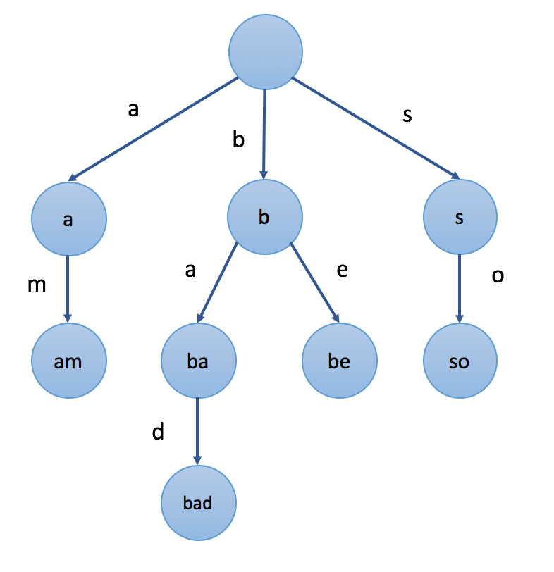

# data-structure-algorithm-in-c

## Trie
### What is Trie
A trie is used to store strings. Each Trie node represents a string (a prefix). Each node might have several children nodes while the paths to different children nodes represent different characters. And the strings the child nodes represent will be the origin string represented by the node itself plus the character on the path. 

Trie is a very useful data structure for string processing. For example, it is used to implement <b>autocomplete</b> and <b>spell checker</b>.

### How to present Trie
<table>
    <tr>
        <th></th>
        <th>Use Array</th>
        <th>Use Map</th>
    </tr>
    <tr>
        <td>Description</td>
        <td>Each TrieNode contains an Array[n], n is the number of characters. Ex: n=26 from 'a'-'z'.
        The new child TrieNode is stored at index = character - 'a' of the parent TrieNode </td>
        <td>Each TrieNode contains a Map of character and the child TrieNode</td>
    </tr>
    <tr>
        <td>Pros</td>
        <td>Fast</td>
        <td>Fast, no need pre-define the size at each TrieNode</td>
    </tr>
    <tr>
        <td>Cons</td>
        <td>Pre-define the array size  Waste of space - each Node has an N-array</td>
        <td>No redundant space</td>
    </tr>
</table>